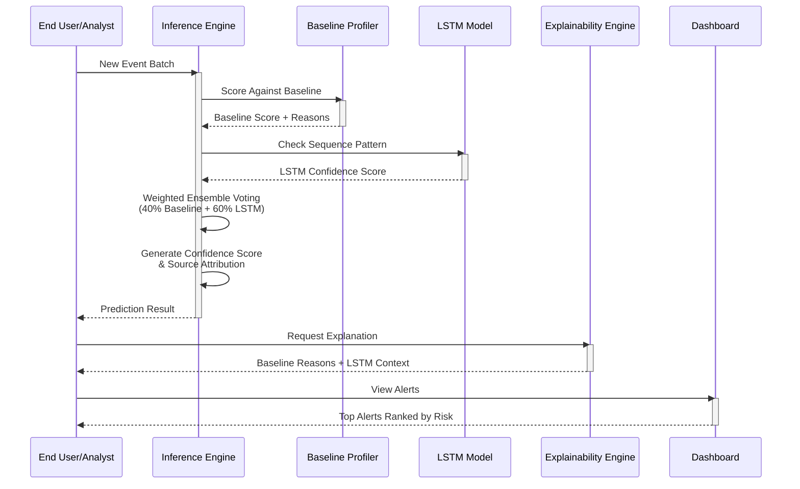
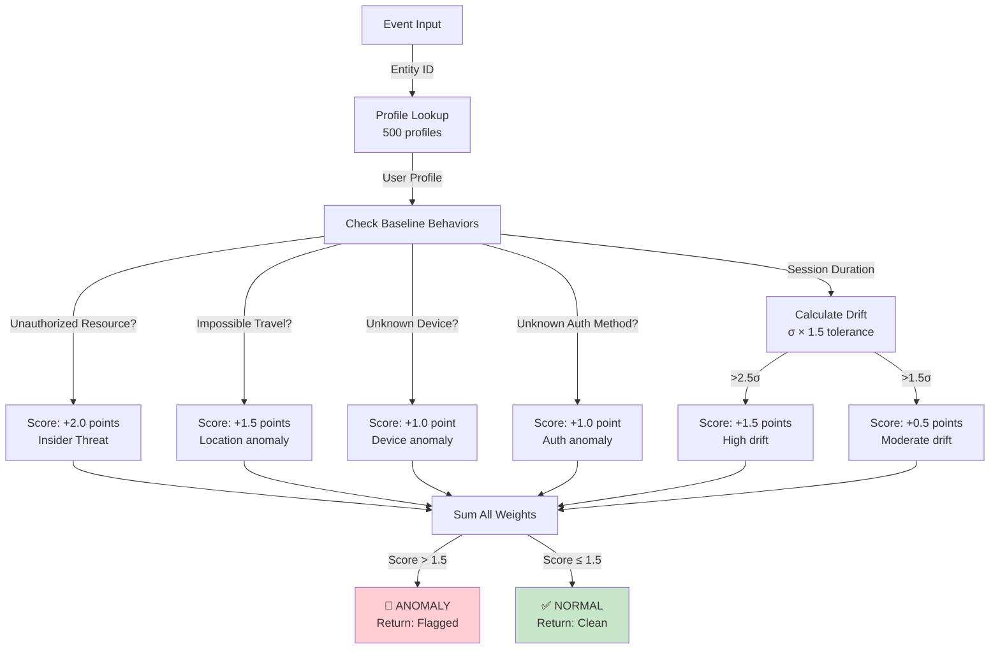
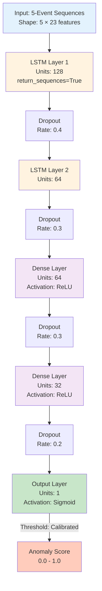
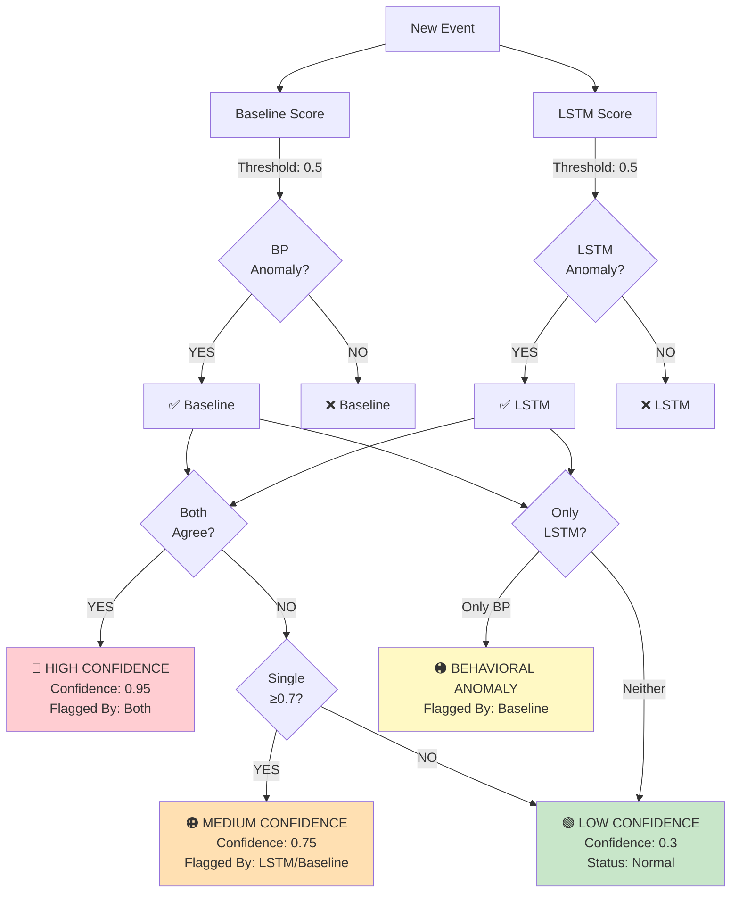
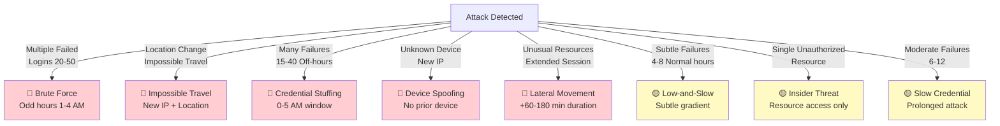

# Anomaly Detection System - Architecture Diagram

## System Architecture Overview

```mermaid
graph TB
    subgraph Data["Data Generation & Processing"]
        DG["Dataset Generator<br/>45,000 synthetic events"]
        UG["User Generator<br/>500 unique users"]
        DEV["Device Generator<br/>700 unique devices"]
        PG["Profile Generator<br/>Baseline behaviors"]
        AG["Attack Generator<br/>900 injected attacks"]
        EG["Event Generator<br/>Normal baseline events"]
    end
    
    subgraph Feature["Feature Engineering"]
        FE["Feature Engineering<br/>23 processed features"]
        SS["StandardScaler<br/>Numeric normalization"]
        LE["LabelEncoder<br/>Categorical encoding"]
    end
    
    subgraph Models["Detection Models"]
        BP["Baseline Profiling<br/>Statistical anomalies<br/>40% weight"]
        LSTM["LSTM Sequence Model<br/>Deep learning detector<br/>60% weight"]
    end
    
    subgraph Training["Model Training"]
        LSTM_Train["LSTM Training<br/>Epochs: 15<br/>Batch Size: 32<br/>Class Weighted"]
        BP_Train["Baseline Profile Building<br/>Per-entity statistics"]
        CAL["Threshold Calibration<br/>F1 score optimization"]
    end
    
    subgraph Persistence["Model Persistence"]
        LSTM_Model["lstm_model.keras<br/>Stacked LSTM architecture"]
        LSTM_Meta["lstm_metadata.pkl<br/>Training metadata"]
        BP_Profile["baseline_profile.pkl<br/>500 entity profiles"]
        Scaler["scaler.pkl<br/>Feature normalization"]
    end
    
    subgraph Inference["Inference Pipeline"]
        Predict["Prediction Engine<br/>Weighted Ensemble Voting<br/>40% Baseline + 60% LSTM"]
        Confidence["Confidence Scoring<br/>0-1 normalized scale"]
        Attribution["Source Attribution<br/>Baseline/LSTM/Both"]
    end
    
    subgraph Output["Output & Explanation"]
        Dashboard["Alert Dashboard<br/>Risk ranking & alerts"]
        Explain["Explainability Engine<br/>Detailed anomaly reasons"]
        History["Entity History View<br/>Temporal context"]
    end
    
    Data -->|Raw Events| Feature
    Feature -->|23 Features| Models
    Models -->|Profiles & Sequences| Training
    Training -->|Trained Models| Persistence
    Persistence -->|Load Models| Inference
    Inference -->|Predictions| Output
    Models -->|Reference| Inference
    
    style Data fill:#e1f5ff
    style Feature fill:#f3e5f5
    style Models fill:#fff3e0
    style Training fill:#f1f8e9
    style Persistence fill:#fce4ec
    style Inference fill:#ffe0b2
    style Output fill:#c8e6c9
```

## Data Flow

## Component Interactions

```mermaid
graph LR
    subgraph Generation["Generation Phase"]
        SynData["Synthetic Data<br/>45,000 events"]
    end
    
    subgraph Processing["Processing Phase"]
        FeatEng["Feature Engineering<br/>23 features"]
    end
    
    subgraph Detection["Detection Phase"]
        BP["Baseline<br/>Profiling"]
        LSTM["LSTM Deep<br/>Learning"]
    end
    
    subgraph Ensemble["Ensemble Decision"]
        Voting["Weighted Voting<br/>40/60 split"]
    end
    
    subgraph Analysis["Analysis Phase"]
        Confidence["Confidence<br/>Scoring"]
        Attribution["Source<br/>Attribution"]
    end
    
    subgraph Presentation["Presentation Phase"]
        Dashboard["Alert<br/>Dashboard"]
        Explain["Anomaly<br/>Explanation"]
    end
    
    Generation -->|Raw| Processing
    Processing -->|Features| Detection
    Detection -->|Scores| Ensemble
    Ensemble -->|Result| Analysis
    Analysis -->|Labeled| Presentation
    
    style Generation fill:#e3f2fd
    style Processing fill:#f3e5f5
    style Detection fill:#fff3e0
    style Ensemble fill:#fce4ec
    style Analysis fill:#e0f2f1
    style Presentation fill:#c8e6c9
```

## Baseline Profiling Architecture

## LSTM Architecture

## Ensemble Decision Logic

## Attack Type Detection Patterns

## Key Statistics

| Component | Value |
|-----------|-------|
| **Data Size** | 45,000 events |
| **Unique Users** | 500 |
| **Unique Devices** | 700 |
| **Attack Percentage** | 2% (900 events) |
| **Features Engineered** | 23 |
| **Baseline Profiles** | 500 |
| **LSTM Epochs** | 15 |
| **LSTM Layers** | 2 LSTM + 2 Dense |
| **Sequence Window** | 5 events |
| **Ensemble Weight Split** | Baseline 40% / LSTM 60% |
| **Attack Types Detected** | 8 types |
| **Confidence Scale** | 0.0 - 1.0 |

## Implementation Files

### Core Detection
- [src/baseline_profiling.py](src/baseline_profiling.py) - Baseline statistical detector
- [src/lstm_sequence_model.py](src/lstm_sequence_model.py) - LSTM deep learning detector
- [src/inference.py](src/inference.py) - Ensemble weighted voting

### Data Processing
- [src/dataset_generator.py](src/dataset_generator.py) - Synthetic data generation
- [src/feature_engineering.py](src/feature_engineering.py) - 23-feature engineering pipeline

### Generation & Attacks
- [src/user_generator.py](src/user_generator.py) - 500 user profiles
- [src/device_generator.py](src/device_generator.py) - 700 device profiles
- [src/attack_generator.py](src/attack_generator.py) - 8 attack types
- [src/event_generator.py](src/event_generator.py) - 45,000 baseline events

### Output & Explanation
- [src/dashboard.py](src/dashboard.py) - Alert dashboard with ranking
- [src/explainability.py](src/explainability.py) - Anomaly explanations

### Models
- [trained_models/lstm_model.keras](trained_models/lstm_model.keras) - Trained LSTM model
- [trained_models/baseline_profile.pkl](trained_models/baseline_profile.pkl) - Baseline profiles
