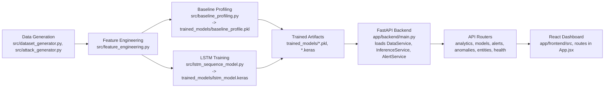
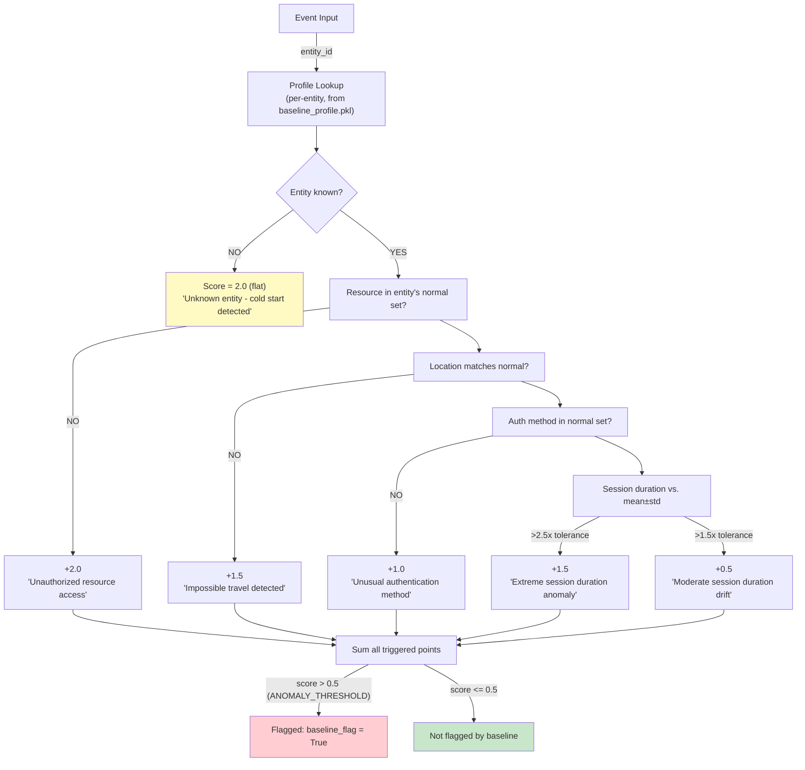
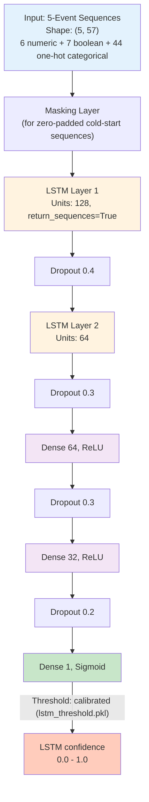
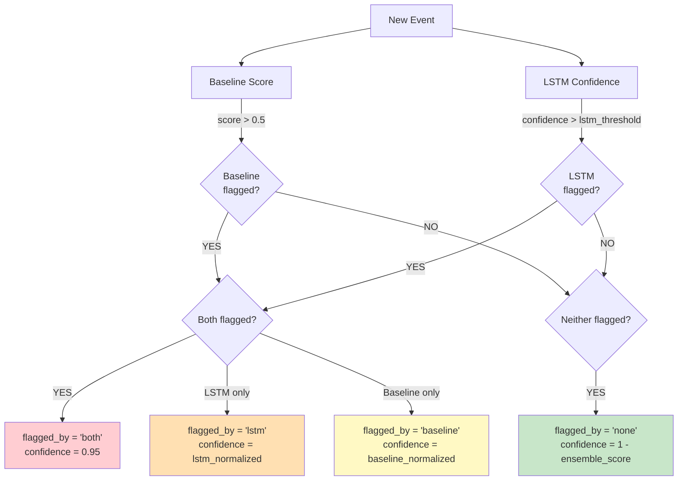

# Anomaly Detection System — Architecture

## System overview (verified from code)

File-backed, batch/on-demand pipeline: synthetic data generation → feature
engineering → model artifact creation → FastAPI inference → React frontend.
No external queue or database is used — everything is file-backed on disk, and
alerts are held in memory for the demo.

## Data flow

1. `app/backend/main.py` initializes `DataService`, `InferenceService`, and
   `AlertService` on startup.
2. `InferenceService` loads artifacts from `trained_models/`: baseline
   profiles, scaler, both feature-column lists (baseline's 22-column list and
   the LSTM's separate 57-column one-hot-expanded list — these are distinct
   artifacts and are not interchangeable), and the LSTM model if TensorFlow is
   available.
3. Incoming events are scored by the baseline profiler and, if the LSTM is
   available, by the sequence model; both are combined in
   `_ensemble_decision()` in `app/backend/services/inference_service.py`.
4. Results are exposed via REST routers under `/api/v1/*` and consumed by the
   React frontend.

---

## Component pipeline

```mermaid
graph LR
    subgraph Generation["Generation"]
        SynData["Synthetic Data<br/>45,000 events"]
    end
    subgraph Processing["Processing"]
        FeatEng["Feature Engineering<br/>23 raw features"]
    end
    subgraph Detection["Detection"]
        BP["Baseline<br/>Profiling"]
        LSTM["LSTM<br/>Sequence Model"]
    end
    subgraph Ensemble["Ensemble Decision"]
        Voting["Weighted Blend<br/>40% baseline / 60% LSTM<br/>OR-based flagging"]
    end
    subgraph Analysis["Analysis"]
        Confidence["Confidence Scoring"]
        Attribution["Flagged-By Attribution"]
    end
    subgraph Presentation["Presentation"]
        Dashboard["Alert Dashboard"]
        Explain["Reason / Explanation"]
    end

    Generation -->|Raw| Processing
    Processing -->|Features| Detection
    Detection -->|Scores| Ensemble
    Ensemble -->|Result| Analysis
    Analysis -->|Labeled| Presentation

    style Generation fill:#e3f2fd
    style Processing fill:#f3e5f5
    style Detection fill:#fff3e0
    style Ensemble fill:#fce4ec
    style Analysis fill:#e0f2f1
    style Presentation fill:#c8e6c9
```

---

## Baseline profiling — actual scoring logic

Verified against `_score_baseline()` in `inference_service.py`. There are
exactly **four** deviation checks — no device-fingerprint check exists in the
live baseline scorer.

---

## LSTM architecture

Verified: 57-feature input (confirmed by direct inspection of
`trained_models/lstm_feature_columns.pkl`), 15 training epochs, batch size 32
(`src/lstm_sequence_model.py`).

Trained with class-weighted binary crossentropy
(`compute_class_weight("balanced")`) to address the extreme class-imbalance
challenge from the brief.

---

## Ensemble decision logic

Verified against `_ensemble_decision()` in `inference_service.py`. There are
exactly **four** outcomes — `both`, `lstm`-only, `baseline`-only, `none`. No
separate "medium confidence, ≥0.7" tier exists in the real code.

`ensemble_score = 0.4 × baseline_normalized + 0.6 × lstm_normalized` (used for
ranking severity, not for the flag/no-flag decision itself, which is OR-based
per above).

---

## Key statistics (verified)

| Component | Value | Source |
|---|---|---|
| Data size | 45,000 events | `data/raw/cybersecurity_dataset.csv` |
| Unique users | 500 | `src/user_generator.py` |
| Unique devices | 700 | `src/device_generator.py` |
| Attack rate | 2% (900 events) | dataset label counts |
| Raw features | 23 | `src/feature_engineering.py` |
| LSTM input features | 57 (after one-hot expansion) | `trained_models/lstm_feature_columns.pkl` |
| LSTM training epochs | 15 | `src/lstm_sequence_model.py` |
| LSTM batch size | 32 | `src/lstm_sequence_model.py` |
| LSTM layers | 2 LSTM (128, 64) + 2 Dense (64, 32) | `src/lstm_sequence_model.py` |
| Sequence window | 5 events | `WINDOW_SIZE` in `inference_service.py` |
| Ensemble weight split | Baseline 40% / LSTM 60% | `app/backend/config.py` |
| Baseline flag threshold | 0.5 | `ANOMALY_THRESHOLD` in `config.py` |
| Attack types | 8 | `src/attack_generator.py` |

---

## Implementation files

**Core detection**
- `src/baseline_profiling.py` — baseline statistical detector
- `src/lstm_sequence_model.py` — LSTM training
- `app/backend/services/inference_service.py` — live scoring + ensemble decision

**Data processing**
- `src/dataset_generator.py` — orchestrates synthetic data generation
- `src/feature_engineering.py` — 23-feature pipeline

**Generation & attacks**
- `src/user_generator.py`, `src/device_generator.py`, `src/event_generator.py`
- `src/attack_generator.py` — 8 attack types

**Output & explanation**
- `src/dashboard.py` — CLI alert queue
- `src/explainability.py` — reason generation

**Evaluation**
- `src/evaluate_models.py` — real held-out precision/recall/F1/AUC + alert-budget FPR

**Models**
- `trained_models/lstm_model.keras`
- `trained_models/baseline_profile.pkl`